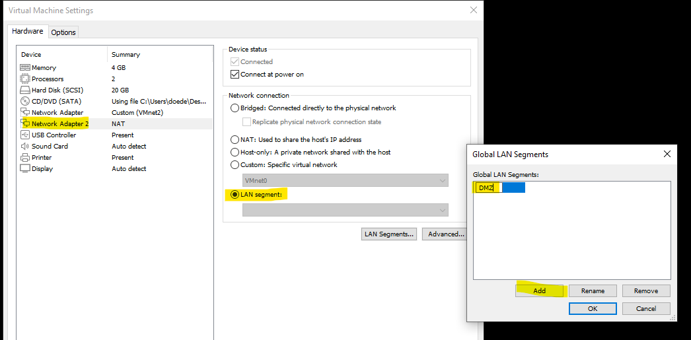

# Firewall Lab

## Inhaltsverzeichnis
[TOC]

## Vorgehen:
- Theorie
- FW Aufsetzen
- FW konfigurieren
- FW Port forwarding

 

# 1.0 Theorie

## 1.1 Einstiegs / Repettiotionsfragen 
Falls die Antwort nicht genug zufriedenstellend ist, google bitte selbst noch weiter!

  
<strong>Was macht ein Router?</strong>

  
Ein Router Verbindet Netzwerke oder Subnetze miteinander. Hierfür ist eine Routingtabelle nötig.
Auch können Router als Gateway dienen.

  
<strong>Was macht eine Bridge?</strong>
 
  
  Die Bridge lernt nach und nach, welche Adressen sich in welchem Netzwerk befinden. Dabei erstellt sie eine Lerntabelle, um Nachrichten an das richtige Netzwerk weiterleiten zu können. Bei Bridge-Netzwerken handelt es sich in der Regel immer um miteinander verbundene LANs.
Ein Bridge verbindet Netzwerke aber routed sie nicht.
  

  
<strong>Was macht eine Firewall?</strong>

  
  Die Firewall trennt das eigene Netzwerk von der Außenwelt ab. Auch sie bilden einen Schutzwall zwischen der Außenwelt und dem Firmennetzwerk.
  

  
<strong>Was versteht man unter dem Begriff Broadcast Domain?</strong>

  
  Teilbereich eines Netzwerks, in dem sich die Teilnehmer über einen Broadcast gegenseitig erreichen können. In der Praxis ist dies über einen Switch, ein WLAN oder ein VLAN realisiert. Eine Broadcast-Domäne ist mit der Definition eines LANs identisch.
  

  
<strong>Wozu verwendet man VLANs?</strong>

  
  Unternehmen verwenden virtuelle LANs oder VLANs, um den Datenverkehr zu segmentieren, Sicherheit zu garantieren, die Leistung zu verbessern und allgemein den Betrieb zu rationalisieren.

  

  
<strong>Was ist ein ARP Broadcast?</strong>

  
  Der ARP-Request ist eine Standardfunktion des IP-Netzwerkprotokolls und wird von Netzwerkteilnehmern zur Vorbereitung der IP-Kommunikation eingesetzt, um die MAC-Adresse eines IP-Teilnehmers zu ermitteln. Ein ARP-Request wird daher als Broadcast an alle Netzwerkteilnehmer geschickt.

  

  
<strong>Was versteht man unter TCP/IP Stack?</strong>

  
  In der Netzwerktechnik wird TCP/IP häufig als Stack bezeichnet. Dies bezieht sich auf die Schichten (TCP, IP und manchmal andere), durch die alle Daten sowohl auf der Client- als auch auf der Serverseite eines Datenaustauschs laufen.
  

  
<strong>Wie unterscheiden sich TCP und UDP?</strong>

  
  UDP:	Beim User Datagram Protocol handelt es sich um ein Kommunikationsprotokoll aus der TCP/IP-Welt, das als verbindungslose, ungesicherte Alternative zum Transmission Control Protocol Verwendung findet
TCP:	Das sogenannte Transmission Control Protocol bildet die Basis für den Datenaustausch im Internet. Es sorgt dafür, dass die Daten in der richtigen Reihenfolge, verbindungsorientiert, verlustsicher, zeitüberwacht und transparent übertragen werden.
  

  
<strong>Wie funktioniert der TCP Verbindungsaufbau?</strong>

  
  TCP sendet Pakete an die Netzwerkschicht und nimmt Pakete von ihr entgegen. TCP verwaltet die Flusskontrolle. Es behandelt die erneute Übertragung von verworfenen oder verstümmelten Paketen, da es eine fehlerfreie Datenübertragung gewährleisten soll. TCP quittiert alle ankommenden Pakete.
  

  
<strong>Was versteht man unter Well-Known Port?</strong>

  
  Ports, welche Standartisiert sind. Nur empfehlung, nicht vorgeschrieben. Standart mässig schaut ein Browser für eine Website auf Port 80/443. Dies kann aber geändert werden zb zu 69. Man muss dem Browser nun sagen, welcher Port. Der Website wird trotzdem funktionieren. Der Port leitet einfach die Anfrage weiter
  

  
<strong>Was ist ein Portscan?</strong>

  
  Bei dem Portscan handelt es sich um einen gezielten Versuch, dass offene Ports und somit angebotene Dienste bei einem Rechner untersucht werden. Es ist eine Methode um beispielsweise offene Ports und somit Sicherheitslücken zu finden.
  

  
<strong>Wozu dient das Protokoll DNS?</strong>

  
  DNS, Domain Name Service, wird für die Namensauflösung verwendet. Es ordnet einer IP-Adresse einen Namen, welcher für uns Menschen einfacher zu merken ist, zu.
  

  
<strong>Wofür verwendet man NAT und Masquerading?</strong>

  
  Network Addres translation
NAT übersetzt die Public IP zu einer Private IP und zurück. Die Private Netzwerke werden mit einer Public IP zusammengefasst. 
  

  
<strong>Wie unterscheiden sich Source und Destination NAT?</strong>

  
  Source-NAT:		 die Adresse des verbindungsaufbauenden Computers (Quelle) verändert. 

Destination-NAT:	Das Packet wird an die Firewall versend, dort wird der Destination-IP auf das eigentliche Ziel angepasst.
  

  
<strong>Wann benötigt man Portforwarding?
</strong>

  
  Der Begriff Port Forwarding beschreibt den Vorgang des Weiterleitens externer IP-Pakete an einen UDP- oder TCP-Port eines Rechners oder Servers im internen LAN. Damit werden Dienste beispielsweise eines Webservers oder eines E-Mail-Servers im LAN aus dem Internet erreichbar.
Portforwarding wird benötigt, um einen Port von dem Privaten ins Public Netzwerk zu stellen
  

  
<strong>Wozu wird ICMP verwendet?</strong>

  
  Das Internet Control Message Protocol kommt in TCP/IP-Netzwerken zum Einsatz, um Informationen über Probleme und den Status des Netzwerks auszutauschen oder Funktionen zu prüfen. Es ist sowohl für IPv4 als auch für IPv6 verfügbar. Über den ICMP-Header werden die Pakettypen definiert.
Ping :Type 8
  

  
<strong>Was ist der Unterschied zwischen HTTP und HTTPS?</strong>

  
  HTTP ist das Akronym für Hypertext Transfer Protocol. Es regelt die Kommunikation zwischen Servern und Clients (Web Browser) bzw. Suchmaschinen-Trackern noch oberhalb des TCP/IP-Protokolls. HTTPS ist http-Secure. Die Voraussetzung für HTTPS ist das Vorhandensein eines gültigen SSL-Zertifikats.
  

  
<strong>Wie unterscheiden sich Endpoint- und Perimeter-Security?</strong>

  

Die Endpoint Security ist dafür zuständig, die unterschiedlichen Endgeräte des Netzwerkes vor den unterschiedlichsten Bedrohungen zu schützen. Der unbefugte Zugriff wird durch technische und organisatorische Maßnahmen verhindert. 
Produkte: Antivirus, Passwort 
Perimeter-Sicherheit soll z. B. mit Firewall-Systemen verhindern, dass Fremde aus dem Internet auf das eigene Unternehmensnetz zugreifen können. 
Perimeter Security: Für ganzes Netzwek
Produkte: Firewall

## 1.2 LAN / WAN / DMZ

LAN (Local Area Network):
Ein Local Area Network (LAN) ist ein Netzwerk, das in einem begrenzten geografischen Bereich wie einem Bürogebäude, einem Campus oder einem Wohnkomplex eingerichtet ist. Es ermöglicht den Datenaustausch und die Ressourcennutzung zwischen den angeschlossenen Geräten, wie z. B. Computern, Druckern, Servern und Netzwerkgeräten. Ein LAN wird normalerweise von einer einzelnen Organisation oder einem einzelnen Unternehmen kontrolliert und verwaltet.

WAN (Wide Area Network):
Ein Wide Area Network (WAN) ist ein Netzwerk, das sich über größere geografische Entfernungen erstreckt und verschiedene LANs oder andere WANs miteinander verbindet. WANs werden verwendet, um den Austausch von Daten und die Kommunikation zwischen entfernten Standorten zu ermöglichen, die möglicherweise in unterschiedlichen Städten, Ländern oder sogar auf verschiedenen Kontinenten liegen. WANs werden häufig von Telekommunikationsunternehmen bereitgestellt und können verschiedene Übertragungsmedien wie Kupferleitungen, Glasfaserkabel oder drahtlose Verbindungen nutzen.

DMZ (Demilitarized Zone):
Eine Demilitarized Zone (DMZ) ist ein Teil eines Netzwerks, der als Pufferzone zwischen einem internen privaten Netzwerk und einem externen öffentlichen Netzwerk dient. Die DMZ wird verwendet, um öffentlich zugängliche Dienste wie Webserver, E-Mail-Server oder FTP-Server zu hosten, während das interne Netzwerk geschützt bleibt. Durch die Platzierung dieser öffentlich zugänglichen Server in der DMZ werden potenzielle Sicherheitsrisiken minimiert, da der direkte Zugriff auf das interne Netzwerk eingeschränkt wird. Eine DMZ wird normalerweise durch Firewalls und andere Sicherheitsmechanismen geschützt, um den Datenverkehr zu überwachen und unerlaubte Zugriffe zu verhindern.

Zusammenfassend kann man sagen, dass LANs für lokale Netzwerke in begrenzten Bereichen verwendet werden, WANs zur Verbindung entfernter Standorte über größere Entfernungen dienen und DMZs als Sicherheitsmechanismus für den Schutz des internen Netzwerks dienen, während öffentlich zugängliche Dienste bereitgestellt werden.

## 1.3 Ports

In der Informatik bezieht sich der Begriff "Port" auf eine spezifische Nummer, die einem bestimmten Dienst oder einer bestimmten Anwendung auf einem Computer zugewiesen ist. Ports ermöglichen die Kommunikation zwischen verschiedenen Geräten und Anwendungen über ein Netzwerk, sei es lokal oder über das Internet.

Ports werden im Rahmen des sogenannten TCP/IP-Protokolls verwendet, das das grundlegende Kommunikationsprotokoll im Internet ist. Das TCP/IP-Protokoll besteht aus zwei Hauptprotokollen: dem Transmission Control Protocol (TCP) und dem Internet Protocol (IP). TCP stellt sicher, dass Datenpakete ordnungsgemäß empfangen und in der richtigen Reihenfolge zusammengesetzt werden, während IP die Adressierung und Weiterleitung der Datenpakete über das Netzwerk ermöglicht.

Jeder Port ist einer bestimmten Anwendung oder einem bestimmten Dienst zugeordnet. Beispielsweise wird der Port 80 normalerweise für HTTP (Hypertext Transfer Protocol) verwendet, das zur Übertragung von Webseiten verwendet wird. Der Port 25 wird typischerweise für den SMTP (Simple Mail Transfer Protocol)-Dienst verwendet, um E-Mails zu versenden. Es gibt auch reservierte Ports wie Port 22 für SSH (Secure Shell) oder Port 443 für HTTPS (Hypertext Transfer Protocol Secure).

Die Verwendung von Ports ermöglicht es, dass mehrere Anwendungen gleichzeitig auf einem Computer laufen können und gleichzeitig über das Netzwerk kommunizieren können, ohne dass es zu Konflikten kommt. Wenn Daten über das Netzwerk gesendet werden, werden sie in Pakete aufgeteilt und mit Informationen über den Quell- und Zielport versehen, um sicherzustellen, dass sie zur richtigen Anwendung oder Dienst gelangen.

Ports können als virtuelle Türen betrachtet werden, die den Datenverkehr steuern und eine geordnete Kommunikation zwischen verschiedenen Anwendungen ermöglichen. Durch die Verwendung spezifischer Ports können Computerdienste identifiziert und angesprochen werden, wodurch die Kommunikation und der Datenaustausch innerhalb von Computernetzwerken effizient und gezielt erfolgen können.

# 2.0 Praxis
Installer Login: 
User: installer
Pw: opnsense

## 2.1 Netzwerkplan
In dieser Aufgabe werden wir dieses Netzwerk aufbauen und die Firwall so konfigurieren, dass der Server sowie der Client voneinander Getrennt sind. Die Firewall regeln werden so konfiguriert, dass der Client auf den Server kommt der Server aber nicht ins Client Netz.

Die Firewall hat also 3 Netzwerkkarten ([Theorie](#lan--wan--dmz))
- WAN
- LAN
- DMZ

## 2.2 Erstellen der Firewall
ISO Herunterladen auf der Offiziellen Hersteller Website (image type -> dvd):
https://opnsense.org/download/

VM Einstellungen:
System:		FreeBSD 12 64 bit
Disk:		mind. 16GB
Ram:		mind. 2GB

Extra Netzwerkkarte hinzufügen:
    Netzwekadapter 1
    -> Bridged 

   Netzwerkadapter 2
   -> Custom (Nicht VMnet1 oder VMnet8)

## 2.3 Aufsetzten der FW
Mit Leertaste hacken setzen, mit enter Weiter gehen
VM anstellen und warten bis installer login kommt
| Bild | Erklärung |
|----------|----------|
|     |Firewall installieren -> usernmae -> installer ; PW -> opnsense        |
|   |Tastaturlayout auf schweiz stellen   |
|   |UFS Installieren   |
|   |Richtige Disk auswählen   |
|   |Bestätigen   |
||Warten :)   |
|| complete install|
Ab jetzt sollte das GUI verfügbar sein (IP der VM im Browser eingeben)

## 2.4 Erstellen von 2 Ubuntu Clients

Falls du nicht weisst wie das geht -> [Anleitung zur Erstellung einer Linux VM](../../setup.md/#3-vm-aufsetzen)

**IMPORTANT** -> Da du sicher mindestens eine VM hast, kannst du diese als [Client, welcher auf FW GUI zugreifft](#netzwerkplan) nutzen 
Die Einzige Änderung die Vorgenommen werden muss -> Netzwerkkarte anpassen

| Bild | Erklärung |
|----------|----------|
|   |  Netzwerk Adapter anpassen auf den der ebenfalls in FW gesetzt ist -> [Firewall Netzwerkkarten](#erstellen-der-firewall) |
|   |Oben Rechts im GUI -> Einstellungen öffnen   |
|   |Bei Netzwerkadapter auf Einstellungen -> in meinem Fall hat es direkt erkannt -> Sonst Profil löschen (wird wieder hinzugefügt -> Next step)   |
|   | FW-IP als DNS angeben, dass IP bezogen werden kann  |

## 2.5 Konfigurieren FW
Wie im Netzwerkplan gesehen haben, haben wir 3 Netzwerkkarten, WAN, LAN, DMZ
Die ersten Zwei Netzkarten haben wir bereits beim [Erstellen der Firewall](#erstellen-der-firewall) gemacht. Die Dritte werden wir nachträglich per GUI hinzufügen (Zum kennenlernen vom GUI und von CLI)
Für Verständnis, [Netzwerkplan](#netzwerkplan) ansehen

### 2.5.0 Credentials
Username -> root
Password -> opnsense

### 2.5.1 Anleitung
| Bild | Erklärung |
|----------|----------|
|   |Netzwerk Interfaces zuweisen (gemäss Netzwerk Plan), n (keine LAGGs konfigurieren), n (keine VLANs jetzt konfigurieren)   |
|  | em0, erste Netzwerkkarte mit Internet (Bridged). Netzkarten werden aufgelistet wie sie in VMWare angezeigt werden (VM Setting).   |
|   |em1, Zweite Netzkarte / Servernetz. Kein Internet, nur für Server, enter drücken, fertig mit Zuweisung   |
|   |Wenn korrekt, mit y bestätigen   |
|   |LAN -> Gelbe IP -> Werden wir im nächsten Schritt ändern / WAN -> Da ihr wahrscheinlich gerade in der SIX sitzt, erhält der WAN Port keine IP -> geblockt -> stellt euch vor ihr hättet Internet :).   |
| |2 -> Set Interface IP -> 1 -> LAN Netzwerk -> via DHCP -> N -> IP setzen (da unsere Firewall Datenpakete abfangt, setzen wir sie als niedrigste IP (quasi Router)) |
|   |Für die Subnetzmaske haben wir ein 24er Netz -> 24 -> kein Upstream GW -> ENTER -> keine IPv6 -> n, n, ENTER   |
|| DHCP auf diesem Server -> y -> Start IP und End IP eingeben  |
|   |Kann man alles mit n ablehnen ausser es wird benötigt (probleme mit ssl Zertifikat / Probleme mit GUI)   |
|   |Auf Linux Client IP im Browser eingeben und mit Credentials anmelden   |

## 2.6 Neues Netzwerk erstellen (GUI)

### 2.6.0 Neue Netzwerkkarte Hinzufügen
| Bild |  Beschreib |
| ---  | ---        |
|   | Neue Netzwerkkarte auf **Firewall** hinzufügen |
||  Die Netzwerkkarte dem Segement DMZ hinzufügen |
|   |Auf Client aufs GUI (192.168.69.1) und anmelden mit Root:opnsense   |
|   |   Interfaces -> Assignments -> Neue Netzkarte erscheint|
|   |Netzwerkkarte enablen   |
|    | Wir geben dem Netzwerkinterface eine Statische IP Adresse |

## 2.6.1 DHCP hinzufügen
| Bild |  Beschreib |
| ---  | ---        |
|      |-> Services  -> DHCPv4  -> DMZ        |
|      |Enable DHCP, Pool setzen            |
|      |**Save**            |
|      |            |

---
 

> [⇧ **Go to Top**](#top)  

> [⇧ **Zurück zur Hauptseite**](/README.md)
---

Autor: Elia Weber